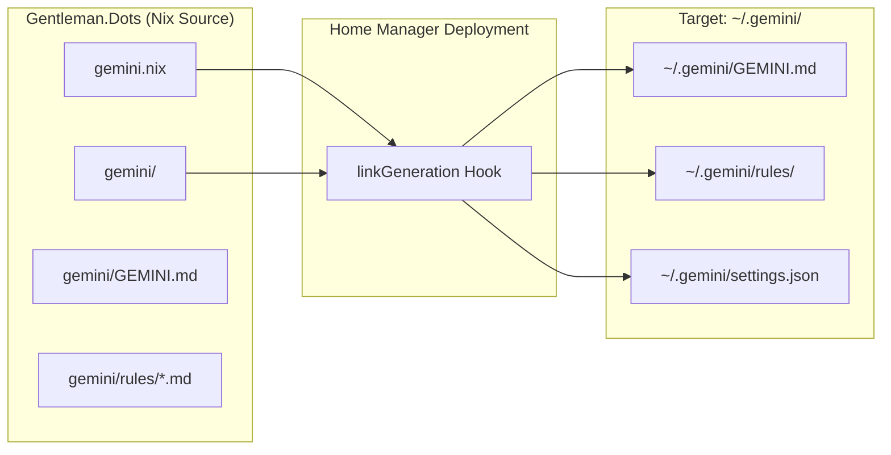
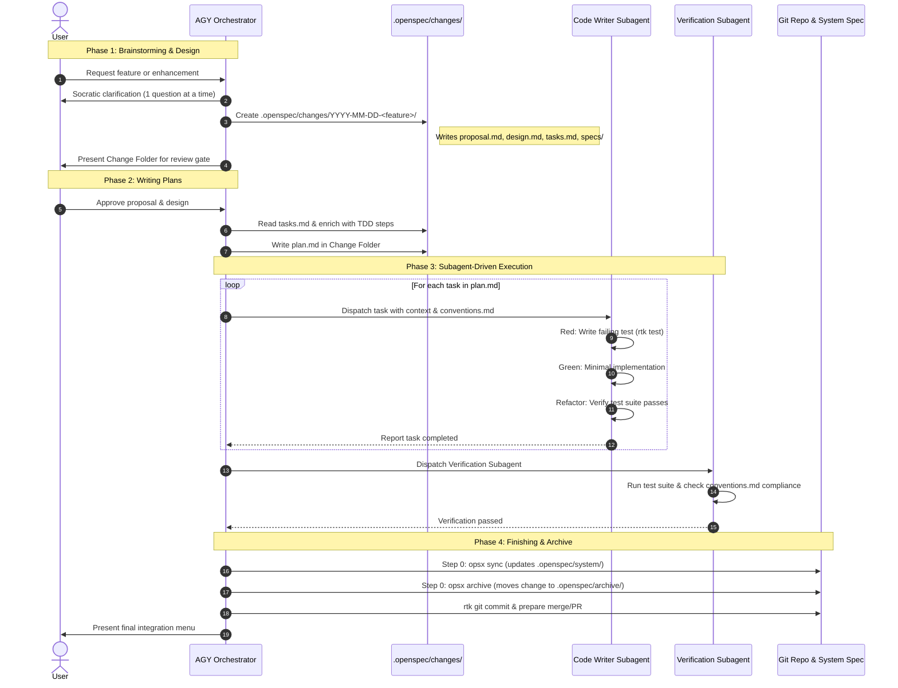
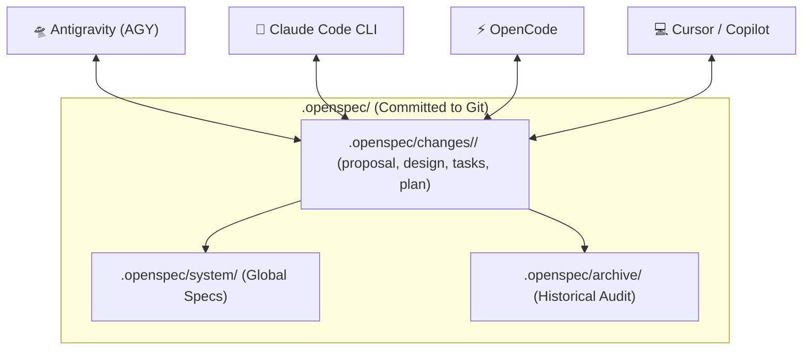

# Antigravity (AGY) Architecture & Spec-Driven Development Workflow

This document provides a comprehensive technical overview of **Antigravity (AGY)** within the [Gentleman.Dots](file:///home/juniorcorzo/Gentleman.Dots) repository: its declarative Nix architecture, modular rules engine, memory persistence, token compression, and integration with the Spec-Driven Development (SDD) lifecycle via OpenSpec and Superpowers.

---

## 1. Overview

**Antigravity (AGY)** is the primary AI development runtime and orchestrator configured in Gentleman.Dots. Designed for deterministic, high-throughput software engineering, AGY operates under strict behavioral contracts, declarative configuration, and persistent memory across execution sessions.

### 1.1 Declarative Management via Nix

All AGY system prompts, behavioral guidelines, operational rules, and environment settings are managed declaratively using Home Manager through [`gemini.nix`](file:///home/juniorcorzo/Gentleman.Dots/gemini.nix).

- **Source of Truth**: Configuration files reside in the version-controlled directory [`gemini/`](file:///home/juniorcorzo/Gentleman.Dots/gemini/).
- **Target Symlinks**: Home Manager maps these configurations directly into the user's home environment at `~/.gemini/`:
  - `~/.gemini/GEMINI.md` ← [`gemini/GEMINI.md`](file:///home/juniorcorzo/Gentleman.Dots/gemini/GEMINI.md) (Master system directive)
  - `~/.gemini/conventions.md` ← [`gemini/conventions.md`](file:///home/juniorcorzo/Gentleman.Dots/gemini/conventions.md) (Project-agnostic global standards)
  - `~/.gemini/settings.json` ← [`gemini/settings.json`](file:///home/juniorcorzo/Gentleman.Dots/gemini/settings.json) (Runtime settings)
  - `~/.gemini/rules/*.md` ← [`gemini/rules/*.md`](file:///home/juniorcorzo/Gentleman.Dots/gemini/rules/) (Modular behavioral rules)
- **Runtime Installation**: Automatically bootstraps required tooling (such as Bun and `@google/gemini-cli`) during Home Manager activation.



Whenever Home Manager switches (`home-manager switch`), the entire Antigravity instruction suite is updated atomically and reproducibly.

---

## 2. Modular Rules Engine (`~/.gemini/rules/`)

Rather than relying on monolithic system prompts, AGY decomposes operational requirements into distinct, enforceable contracts located in [`gemini/rules/`](file:///home/juniorcorzo/Gentleman.Dots/gemini/rules/). The master entrypoint [`GEMINI.md`](file:///home/juniorcorzo/Gentleman.Dots/gemini/GEMINI.md) enforces that every rule file is mandatory and binding on every turn across all sessions and workspaces.

| Rule File | Core Responsibility | Key Mandates |
| :--- | :--- | :--- |
| [`persona.md`](file:///home/juniorcorzo/Gentleman.Dots/gemini/rules/persona.md) | Persona, Communication, Delegation & Gates | Caveman Mode Ultra, Conventions Gate, Subagent Writer/Verifier, Reactive Wakeup |
| [`engram.md`](file:///home/juniorcorzo/Gentleman.Dots/gemini/rules/engram.md) | Persistent Cross-Session Memory | Proactive saves, delivery guarantee, search protocol, session summaries |
| [`strict-tdd.md`](file:///home/juniorcorzo/Gentleman.Dots/gemini/rules/strict-tdd.md) | Quality & Test Discipline | Red-Green-Refactor cycle enforced on all code additions |
| [`rtk.md`](file:///home/juniorcorzo/Gentleman.Dots/gemini/rules/rtk.md) | Context & Token Optimization | Rust Token Killer proxy prefixing on all shell commands |
| [`codegraph.md`](file:///home/juniorcorzo/Gentleman.Dots/gemini/rules/codegraph.md) | Codebase Navigation | Priority indexing with `codegraph_explore` MCP over blind grep/find |
| [`agent-routing.md`](file:///home/juniorcorzo/Gentleman.Dots/gemini/rules/agent-routing.md) | Execution Topology & User Controls | Direct inline vs. delegated direct; kill switches for review mode |
| [`superpowers.md`](file:///home/juniorcorzo/Gentleman.Dots/gemini/rules/superpowers.md) | Skill Orchestration Binding | Bridges Superpowers skills with system rules and project conventions |

### 2.1 Persona & Architectural Directives (`persona.md`)

- **Senior Architect Character**: Emulates a 15+ years Senior Architect, Google Developer Expert (GDE), and Microsoft MVP with Nortesantandereano / Cucuteño warmth and passion for developer growth.
- **Persona Scope Separation**:
  - *Chat text*: Warm, authentic Cucuteño Spanish ("mano", "ole", "póngale cuidado") or warm direct English matching user language.
  - *Technical Artifacts*: Strict professional English. Code, commit messages, PRs, identifiers, and documentation **never** receive persona slang.
- **Caveman Mode (Ultra)**: Direct, high-density telegraphic replies. Conversational filler and pleasantries are eliminated. Explanations remain technically deep but zero fluff.
- **Conventions Gate (Mandatory & Blocking)**: Before modifying or executing any task in a repository, AGY must verify the existence of [`conventions.md`](file:///home/juniorcorzo/Gentleman.Dots/conventions.md) in the project root. If absent, execution halts immediately and requests creation.
- **Mandatory Subagent Delegation**:
  - *Writer Subagent*: Orchestrator must never directly write implementation code in the primary thread. It delegates file modifications to specialized code writing subagents with explicit context and `conventions.md`.
  - *Verification Subagent*: Any task resulting in code modification triggers a mandatory verification subagent upon completion to ensure full compliance with tests and conventions.
- **Reactive Wakeup**: AGY agents never poll background tasks or set idle sleep timers. The execution engine reactively resumes upon subagent completion or command exit.

### 2.2 Engram Persistent Memory Protocol (`engram.md`)

AGY integrates with **Engram**, an SQLite-backed vector and graph memory system exposed through Model Context Protocol (MCP) tools:

- **Proactive Save Triggers**: Immediately invokes `mem_save` without user prompting when:
  - Architecture or design decisions are finalized.
  - Conventions, patterns, or preferences are established.
  - Bug root causes and fixes are identified.
  - Complex repository discoveries or edge cases are uncovered.
- **Delivery Guarantee**: Memory storage (`mem_save`) is internal bookkeeping and **never** counts as an answer to the user. User replies must always contain the full substantive response.
- **Search Workflow**:
  1. `mem_context`: Fast query over recent session activities.
  2. `mem_search`: Keyword and semantic lookup across project memories.
  3. `mem_get_observation`: Full untruncated retrieval of past decisions.
- **Session Close Protocol**: Before completing a session, AGY invokes `mem_session_summary` with structured sections: *Goal*, *Instructions*, *Discoveries*, *Accomplished*, and *Next Steps*.

### 2.3 Strict TDD Enforcement (`strict-tdd.md`)

When active, AGY enforces strict Test-Driven Development:
1. **Red**: Write a minimal unit/integration test capturing the requirement and execute it to confirm test failure.
2. **Green**: Write the minimal implementation code to pass the test.
3. **Refactor**: Clean up the architecture while maintaining a passing test suite.
Implementation code must never be introduced without a preceding failing test.

### 2.4 Token Minimization via RTK (`rtk.md`)

To prevent context exhaustion and minimize token consumption by up to 90%, AGY executes shell commands through the **Rust Token Killer (RTK)** proxy CLI:

```bash
# Standard command invocations wrapped with rtk
rtk git status
rtk cargo test
rtk ls -la src/
rtk grep "pattern" src/
rtk gh pr list

# RTK token metrics inspection
rtk gain              # Display current session token savings
rtk gain --history    # Historic token savings report
rtk discover          # Identify missed optimization opportunities
```

### 2.5 CodeGraph Exploration Priority (`codegraph.md`)

Whenever a repository contains a `.codegraph/` index, AGY prioritizes AST-aware graph traversal over raw file search:
- Invokes `codegraph_explore` MCP tool or CLI (`codegraph explore "<query>"`) to retrieve verbatim symbols, relationships, and dynamic dispatch call paths in a single pass.
- Eliminates multi-step iterative grep and file-reading queries.

### 2.6 Agent Routing & Implementation Topologies (`agent-routing.md`)

AGY selects the smallest useful topology for every change:
- **Direct Inline**: Limited to 1–3 files for straightforward, mechanical edits with zero ambiguous design decisions.
- **Delegated Direct**: Triggered for 4+ files exploratory research or 2+ non-trivial file modifications.
- **User Control Kill Switch**: Receipt-driven development and review automation respect explicit user control (`gentle-ai review mode enable|disable|status`).

### 2.7 Superpowers Orchestration Contract (`superpowers.md`)

Binds high-level skills with system-level rules:
- Skills like `brainstorming` and `writing-plans` enforce Caveman Mode and single-question Socratic inquiry.
- `subagent-driven-development` enforces the Code Writing Subagent requirement.
- `verification-before-completion` enforces mandatory subagent verification.
- All command executions across all skills route through `rtk`.

---

## 3. Spec-Driven Development (SDD) & OpenSpec Integration

Antigravity couples the **Superpowers** execution framework with **OpenSpec** (`@fission-ai/openspec`) to deliver a unified, repository-tracked specification lifecycle.

Instead of keeping architectural state trapped in conversational memory, all specifications, task matrices, and verification plans are committed directly to Git in `.openspec/`.

```
<repo-root>/
├── .openspec/
│   ├── system/                        # Global system spec master (permanent source of truth)
│   │   └── *.md
│   ├── changes/                       # Active Change Folders (in-flight features)
│   │   └── YYYY-MM-DD-<feature>/
│   │       ├── proposal.md            # Feature intent, motivation, and scope
│   │       ├── design.md              # In-depth architectural design specification
│   │       ├── tasks.md               # Atomic checklist of implementation tasks
│   │       ├── plan.md                # TDD execution plan generated by writing-plans
│   │       └── specs/                 # Component delta specs (ADDED / MODIFIED / REMOVED)
│   │           └── <component>.md
│   └── archive/                       # Permanent historical audit trail of completed features
│       └── YYYY-MM-DD-<feature>/
├── .superpowers/sdd/                  # Git-ignored execution state / ledgers
└── conventions.md                     # Project architecture & code standards gate
```

### 3.1 The End-to-End SDD Lifecycle



### 3.2 Phase Breakdown

#### Phase 1: Brainstorming (`/superpowers:brainstorming`)
- **Intent**: Clarifies ambiguities before generating any code.
- **Workflow**:
  - Enforces one question at a time.
  - Inspects project root for `.openspec/`. If missing, instructs user to run `openspec init`.
  - Produces the Change Folder in `.openspec/changes/YYYY-MM-DD-<feature>/` containing:
    - `proposal.md`: Summary of problem, user value, and scope.
    - `design.md`: Detailed architecture, API signatures, error handling, and file changes.
    - `tasks.md`: High-level checklist of deliverables.
    - `specs/*.md`: Component delta specifications tagged with `ADDED`, `MODIFIED`, or `REMOVED`.
- **Review Gate**: Stops and requests explicit user sign-off on the generated Change Folder.

#### Phase 2: Writing Plans (`writing-plans`)
- **Intent**: Converts the abstract design into a deterministic, executable test-and-code schedule.
- **Workflow**:
  - Consumes `tasks.md` from the Change Folder as input.
  - Enriches each task with concrete test code, shell execution commands, interface types, and atomic Git commit steps.
  - Emits [`plan.md`](file:///home/juniorcorzo/Gentleman.Dots/docs/superpowers/plans/) directly inside the active Change Folder (`.openspec/changes/YYYY-MM-DD-<feature>/plan.md`).

#### Phase 3: Subagent-Driven Development (`subagent-driven-development`)
- **Intent**: Isolates code writing from orchestration, preventing context drift.
- **Workflow**:
  - The orchestrator dispatches fresh Code Writing subagents per task.
  - Each subagent executes the strict TDD loop:
    1. Write test asserting new behavior.
    2. Run test with `rtk` to verify expected failure (Red).
    3. Implement minimal code to satisfy the test (Green).
    4. Refactor and verify clean passing state.
  - Once all implementation tasks finish, the orchestrator dispatches a **Verification Subagent** to audit full compliance against [`conventions.md`](file:///home/juniorcorzo/Gentleman.Dots/conventions.md).

#### Phase 4: Branch Finalization (`finishing-a-development-branch`)
- **Step 0: OpenSpec Sync & Archive**:
  - Detects the active Change Folder.
  - Runs `opsx:sync` (or `openspec sync`) to update `.openspec/system/` with newly implemented behavior.
  - Runs `opsx:archive` (or `openspec archive`) to move `.openspec/changes/YYYY-MM-DD-<feature>/` to `.openspec/archive/YYYY-MM-DD-<feature>/`.
- **Step 1+: Branch Integration**:
  - Runs the full regression test suite via `rtk`.
  - Presents integration options (squash merge, branch rebase, or PR creation) to the user.

---

## 4. Multi-Tool Interoperability

A central advantage of the OpenSpec + Antigravity architecture is **tool independence**. Because specifications and active plans live as standard Markdown files inside `.openspec/`, external AI tools seamlessly participate in the development lifecycle without losing context:



- **Claude Code CLI**: Can read `plan.md` and execute sub-tasks using identical skills.
- **OpenCode Multi-Agent**: Employs its 12 specialized agents against the exact same `.openspec/changes/` artifacts.
- **Cursor / VS Code Copilot**: Developers working in GUI editors can point prompts directly to `.openspec/changes/<feature>/design.md` for context-aware completion.
- **No Vendor Lock-in**: Session state compactions or AI vendor API outages do not compromise project specifications.

---

## 5. Developer Quick Reference

### Shell Commands & Aliases

```bash
# OpenSpec commands
openspec init                     # Initialize OpenSpec in a new repository
openspec sync                     # Synchronize active changes into system specifications
openspec archive <feature>        # Archive a completed change folder

# RTK token optimization commands
rtk git status                    # Run git status with token compression
rtk cargo test                    # Run tests with filtered output
rtk gain                          # View total token savings for the session
rtk gain --history                # Display history of token reductions

# Memory inspection (MCP Tools)
mem_context                       # Inspect recent session memory
mem_search "<query>"              # Query persistent knowledge base
mem_session_summary               # Trigger end-of-session summary
```

### Related Configurations & Documents

- [`gemini.nix`](file:///home/juniorcorzo/Gentleman.Dots/gemini.nix) — Nix module declaring AGY file mappings.
- [`gemini/GEMINI.md`](file:///home/juniorcorzo/Gentleman.Dots/gemini/GEMINI.md) — Master entrypoint for agent directives.
- [`gemini/rules/`](file:///home/juniorcorzo/Gentleman.Dots/gemini/rules/) — Modular behavioral rules engine.
- [`conventions.md`](file:///home/juniorcorzo/Gentleman.Dots/conventions.md) — Repository architecture, Nix, Lua, and shell conventions.
- [`docs/superpowers/specs/2026-09-07-openspec-superpowers-integration-design.md`](file:///home/juniorcorzo/Gentleman.Dots/docs/superpowers/specs/2026-09-07-openspec-superpowers-integration-design.md) — OpenSpec Superpowers integration specification.
